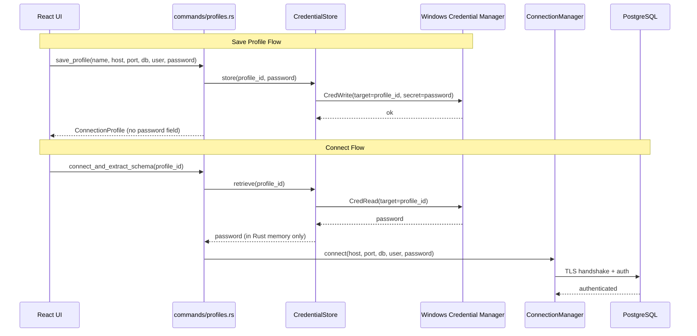

# 11. Backend Architecture

## 11.1 Service Architecture

### Module Organization

```plaintext
src-tauri/src/
├── main.rs
├── lib.rs
├── commands/
│   ├── mod.rs
│   ├── connection.rs
│   ├── profiles.rs
│   ├── annotations.rs
│   ├── prompt.rs
│   └── clipboard.rs
├── services/
│   ├── mod.rs
│   ├── connection_manager.rs
│   ├── schema_extractor.rs
│   └── prompt_generator.rs
├── repositories/
│   ├── mod.rs
│   ├── profile_repository.rs
│   └── annotation_repository.rs
├── credential_store.rs
├── db.rs
├── models.rs
├── errors.rs
└── migrations/
    └── 001_initial.sql
```

### Command Handler Template

```rust
#[tauri::command]
async fn connect_and_extract_schema(
    profile_id: String,
    state: tauri::State<'_, AppState>,
    window: tauri::Window,
) -> Result<SchemaTree, AppError> {
    let profile = state.profile_repo.lock().await.find(&profile_id)?;
    let password = state.credential_store.retrieve(&profile_id)?;
    let pool = state.connection_manager.lock().await
        .connect(&profile, &password).await?;
    let schema_tree = state.schema_extractor
        .extract(&pool, &window).await?;
    Ok(schema_tree)
}
```

## 11.2 Database Architecture

Repository pattern — each repo receives a `rusqlite::Connection` from Tauri managed state. WAL mode enabled for concurrent reads during schema extraction.

```rust
pub fn upsert(&self, params: UpsertAnnotationParams) -> Result<Annotation, AppError> {
    let conn = self.conn.lock().unwrap();
    conn.execute(
        "INSERT INTO annotations
            (id, connection_profile_id, schema_name, table_name, column_name, text, updated_at)
         VALUES (?1, ?2, ?3, ?4, ?5, ?6, datetime('now'))
         ON CONFLICT(connection_profile_id, schema_name, table_name, column_name)
         DO UPDATE SET text = excluded.text, updated_at = datetime('now')",
        rusqlite::params![/* ... */],
    )?;
    self.find_by_key(&params)
}
```

## 11.3 Authentication and Authorization

No user authentication (single-user local app). Credential handling via Windows Credential Manager only.

### Auth Flow



### Credential Store

```rust
pub struct CredentialStore { service_name: String }

impl CredentialStore {
    pub fn store(&self, profile_id: &str, password: &str) -> Result<(), AppError> {
        let entry = Entry::new(&self.service_name, profile_id)?;
        entry.set_password(password).map_err(AppError::from)
    }
    pub fn retrieve(&self, profile_id: &str) -> Result<String, AppError> {
        let entry = Entry::new(&self.service_name, profile_id)?;
        entry.get_password().map_err(AppError::from)
    }
    pub fn delete(&self, profile_id: &str) -> Result<(), AppError> {
        let entry = Entry::new(&self.service_name, profile_id)?;
        entry.delete_password().map_err(AppError::from)
    }
}
```

## 11.4 Tauri Managed State

```rust
tauri::Builder::default()
    .manage(AppState {
        connection_manager: Mutex::new(ConnectionManager::new()),
        schema_extractor: SchemaExtractor::new(),
        prompt_generator: PromptGenerator::new(),
        profile_repo: Mutex::new(ProfileRepository::new(db_conn.clone())),
        annotation_repo: Mutex::new(AnnotationRepository::new(db_conn.clone())),
        credential_store: CredentialStore::new("schemalift"),
    })
    .invoke_handler(tauri::generate_handler![
        test_connection, connect_and_extract_schema, disconnect,
        list_profiles, save_profile, rename_profile, delete_profile,
        load_annotations, upsert_annotation, delete_annotation,
        generate_prompt, copy_to_clipboard,
    ])
```

## 11.5 Error Handling

```rust
#[derive(Debug, thiserror::Error, serde::Serialize)]
#[serde(tag = "code", content = "message")]
pub enum AppError {
    #[error("Could not reach host. Check the hostname and port.")]
    HostUnreachable(String),
    #[error("Authentication failed. Check your username and password.")]
    AuthFailed(String),
    #[error("Database not found. Check the database name.")]
    DatabaseNotFound(String),
    #[error("Connection timed out after {0} seconds.")]
    ConnectionTimeout(u64),
    #[error("Profile not found.")]
    ProfileNotFound,
    #[error("A profile with this name already exists.")]
    DuplicateProfileName,
    #[error("Failed to store credentials securely.")]
    CredentialStoreError(String),
    #[error("Failed to retrieve credentials.")]
    CredentialNotFound(String),
    #[error("Schema extraction failed: {0}")]
    ExtractionFailed(String),
    #[error("Annotation text exceeds 500 character limit.")]
    AnnotationTooLong,
    #[error("Internal error: {0}")]
    Internal(String),
}
```

---
