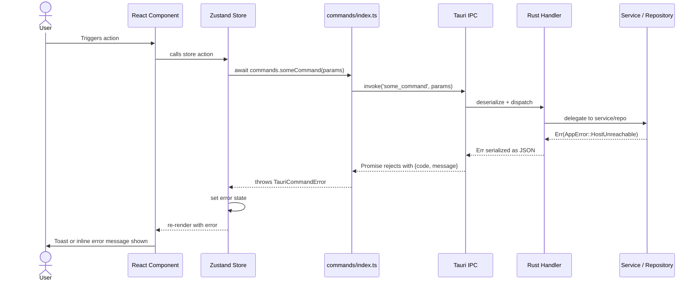

# 18. Error Handling Strategy

## 18.1 Error Flow



## 18.2 Error Response Format

```typescript
interface TauriCommandError {
  code: string;     // e.g., "HostUnreachable", "AuthFailed"
  message: string;  // human-readable, safe to display
}

function isTauriError(err: unknown): err is TauriCommandError {
  return typeof err === 'object' && err !== null &&
    'code' in err && 'message' in err
}
```

## 18.3 Two Error Surfaces

- **Store state** — for persistent errors (connection failure) that should persist until resolved
- **Toast** — for transient action errors (delete failed, rename failed) that self-dismiss

## 18.4 Unrecoverable States

| Scenario | Behaviour |
|----------|-----------|
| SQLite corrupt on startup | Fatal error dialog + exit |
| WinCred unavailable | `CredentialStoreError` surfaced on connect |
| `connection_lost` event | Shell clears state + redirects to Connection screen |
| Mutex lock poisoned | Surfaces as `Internal` error; user must restart |

---
