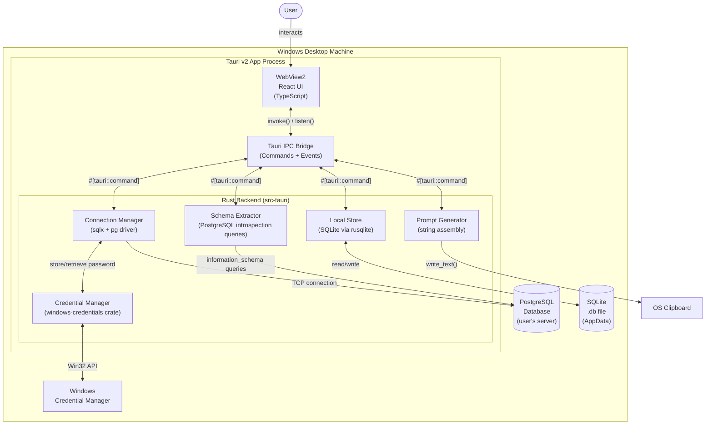

# 2. High Level Architecture

## 2.1 Technical Summary

SchemaLift is a **desktop monolith** built with Tauri v2, combining a React/TypeScript WebView frontend with a Rust backend process running on the user's Windows machine. There is no remote server, no cloud dependency, and no HTTP API — all communication between UI and system services flows through Tauri's typed IPC command layer. The application connects directly to PostgreSQL databases over the local network, extracts schema metadata via the `sqlx` Rust crate, persists connection profiles and annotations in an embedded SQLite database, and stores credentials exclusively in the Windows Credential Manager. Distribution is a self-contained `.exe` installer — users need no runtime, no dependencies, and no internet connection after install.

## 2.2 Platform and Infrastructure Choice

This is a local desktop app — no cloud platform applies. The "infrastructure" is the user's Windows machine.

| Layer | Choice | Rationale |
|-------|--------|-----------|
| Desktop runtime | Tauri v2 | Lighter than Electron (~8MB vs ~120MB); Rust backend gives native OS API access (WinCred) |
| Frontend renderer | WebView2 (built into Windows 10+) | Zero additional install; always present on target OS |
| Distribution | `.exe` installer via NSIS (Tauri built-in) | No store required for MVP; direct download |
| Dev machine hosting | Local only | No staging/prod environments for MVP |

## 2.3 Repository Structure

**Monorepo — single repository, Tauri default layout.**

```
Structure:    Tauri v2 default (no monorepo tool needed — two natural packages: frontend + src-tauri)
Package org:  src/ (React app, managed by Vite/npm) + src-tauri/ (Rust crate, managed by Cargo)
Shared types: TypeScript interfaces in src/types/ mirror Rust structs — kept in sync manually (no code-gen for MVP)
```

## 2.4 High Level Architecture Diagram



## 2.5 Architectural Patterns

- **Desktop Monolith:** Single process, single deployable unit — _Rationale:_ MVP simplicity; no network surface area; aligns with offline-first privacy requirement
- **IPC Command Pattern (Tauri):** All frontend→backend calls are named typed commands via `invoke()`; backend→frontend events via `emit()` — _Rationale:_ Enforces clear layer separation; Tauri's built-in serialization prevents raw FFI leakage
- **Repository Pattern (Rust):** SQLite access abstracted behind trait-based repository structs — _Rationale:_ Keeps command handlers thin; enables unit testing of persistence logic without a real DB
- **Component-Based UI:** React functional components with hooks; no class components — _Rationale:_ Modern React standard; aligns with Tauri starter scaffold
- **Local-First Architecture:** All reads/writes happen on device; no network calls except to the user's own PostgreSQL server — _Rationale:_ Core product promise; privacy-safe by design; eliminates backend ops cost

---
