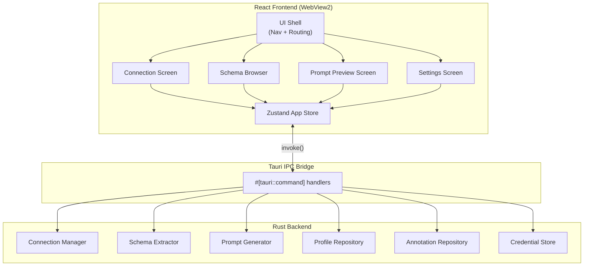

# 6. Components

## 6.1 Connection Manager (Rust)

**Responsibility:** Owns the active PostgreSQL connection pool. Handles connect, disconnect, test-connection, and credential retrieval from Windows Credential Manager.

**Key Interfaces:**
- `test_connection(params)` → `Result<(), AppError>`
- `connect(profile_id)` → `Result<PgPool, AppError>`
- `disconnect()` → `Result<(), AppError>`

**Dependencies:** `sqlx` (PgPool), `keyring` crate, `ConnectionProfileRepository`

**Technology:** Rust, sqlx async connection pool, Tauri managed state

---

## 6.2 Schema Extractor (Rust)

**Responsibility:** Runs `information_schema` and `pg_catalog` introspection queries against the active connection to produce a complete `SchemaTree`.

**Key Interfaces:**
- `extract_schema(pool)` → `Result<SchemaTree, AppError>`
- `emit_progress(window, loaded, total)`

**Dependencies:** Connection Manager (active PgPool), Tauri `Window`

**Technology:** Rust, sqlx queries against `information_schema`

---

## 6.3 Prompt Generator (Rust)

**Responsibility:** Takes a selection of tables/columns plus their annotations and assembles the formatted LLM prompt string.

**Key Interfaces:**
- `generate_prompt(selection, annotations, schema_tree)` → `Result<PromptBlock, AppError>`

**Dependencies:** Schema Extractor output, Annotation Repository

**Technology:** Rust string formatting

---

## 6.4 Connection Profile Repository (Rust)

**Responsibility:** CRUD operations for `ConnectionProfile` records in SQLite. Handles migrations on startup.

**Key Interfaces:** `list()`, `insert(params)`, `rename(id, name)`, `delete(id)`

**Dependencies:** `rusqlite`, Tauri path API

---

## 6.5 Annotation Repository (Rust)

**Responsibility:** CRUD for `Annotation` records in SQLite. Upserts on every debounced keystroke.

**Key Interfaces:** `load_for_profile(id)`, `upsert(params)`, `delete(id)`, `delete_for_profile(id)`

**Dependencies:** `rusqlite`

---

## 6.6 Credential Store (Rust)

**Responsibility:** Thin wrapper around Windows Credential Manager. Stores and retrieves passwords keyed by `profile_id`.

**Key Interfaces:** `store(id, password)`, `retrieve(id)`, `delete(id)`

**Technology:** `keyring` crate (WinCred backend)

---

## 6.7 React UI Shell (Frontend)

**Responsibility:** App entry point. Renders persistent nav, routes between screens, hosts global Tauri event listeners.

**Dependencies:** Zustand store, React Router, all screen components

---

## 6.8 Schema Browser (Frontend)

**Responsibility:** Renders the interactive schema tree with checkboxes, search/filter, annotation indicators, and inline annotation input.

**Dependencies:** Zustand store, shadcn/ui, `@tanstack/virtual` (if > 100 nodes)

---

## 6.9 Zustand App Store (Frontend)

**Responsibility:** Single source of truth for all runtime UI state.

**Key state:** `connection`, `schemaTree`, `selection`, `annotations`, `prompt`

---

## 6.10 Component Diagram

---
