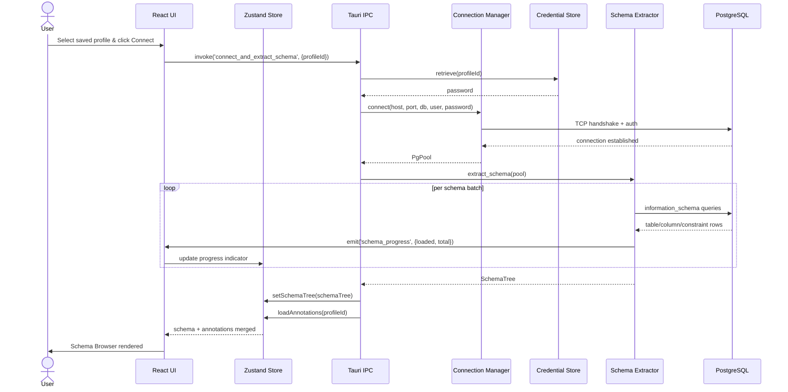
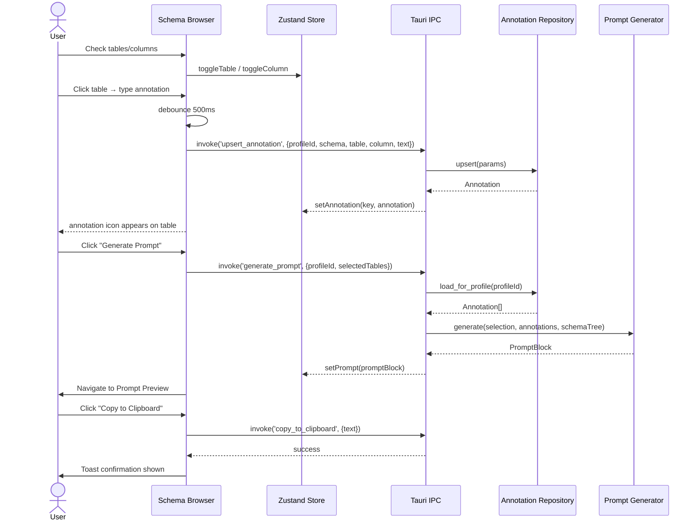
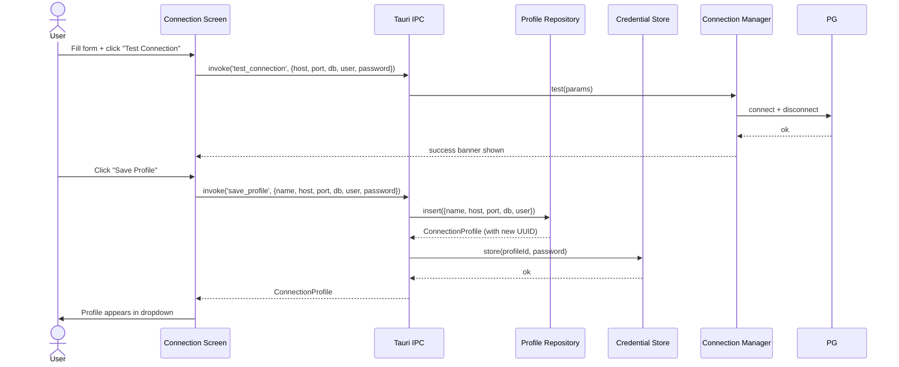
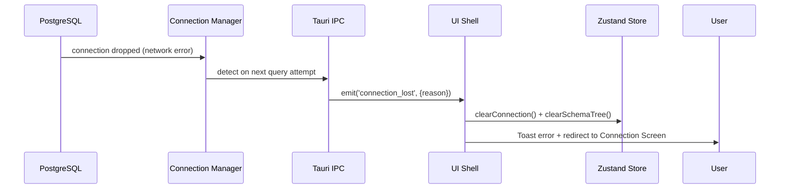

# 8. Core Workflows

## 8.1 Connect & Extract Schema

```mermaid
sequenceDiagram
    actor User
    participant UI as React UI
    participant Store as Zustand Store
    participant Tauri as Tauri IPC
    participant CM as Connection Manager
    participant CS as Credential Store
    participant SE as Schema Extractor
    participant PG as PostgreSQL

    User->>UI: Select saved profile & click Connect
    UI->>Tauri: invoke('connect_and_extract_schema', {profileId})
    Tauri->>CS: retrieve(profileId)
    CS-->>Tauri: password
    Tauri->>CM: connect(host, port, db, user, password)
    CM->>PG: TCP handshake + auth
    PG-->>CM: connection established
    CM-->>Tauri: PgPool
    Tauri->>SE: extract_schema(pool)
    loop per schema batch
        SE->>PG: information_schema queries
        PG-->>SE: table/column/constraint rows
        SE->>UI: emit('schema_progress', {loaded, total})
        UI->>Store: update progress indicator
    end
    SE-->>Tauri: SchemaTree
    Tauri->>Store: setSchemaTree(schemaTree)
    Tauri->>Store: loadAnnotations(profileId)
    Store-->>UI: schema + annotations merged
    UI->>User: Schema Browser rendered
```

## 8.2 Annotate & Generate Prompt

```mermaid
sequenceDiagram
    actor User
    participant UI as Schema Browser
    participant Store as Zustand Store
    participant Tauri as Tauri IPC
    participant AR as Annotation Repository
    participant PG_GEN as Prompt Generator

    User->>UI: Check tables/columns
    UI->>Store: toggleTable / toggleColumn
    User->>UI: Click table → type annotation
    UI->>UI: debounce 500ms
    UI->>Tauri: invoke('upsert_annotation', {profileId, schema, table, column, text})
    Tauri->>AR: upsert(params)
    AR-->>Tauri: Annotation
    Tauri-->>Store: setAnnotation(key, annotation)
    UI-->>User: annotation icon appears on table

    User->>UI: Click "Generate Prompt"
    UI->>Tauri: invoke('generate_prompt', {profileId, selectedTables})
    Tauri->>AR: load_for_profile(profileId)
    AR-->>Tauri: Annotation[]
    Tauri->>PG_GEN: generate(selection, annotations, schemaTree)
    PG_GEN-->>Tauri: PromptBlock
    Tauri-->>Store: setPrompt(promptBlock)
    UI->>User: Navigate to Prompt Preview

    User->>UI: Click "Copy to Clipboard"
    UI->>Tauri: invoke('copy_to_clipboard', {text})
    Tauri-->>UI: success
    UI->>User: Toast confirmation shown
```

## 8.3 Save New Connection Profile

```mermaid
sequenceDiagram
    actor User
    participant UI as Connection Screen
    participant Tauri as Tauri IPC
    participant CPR as Profile Repository
    participant CS as Credential Store
    participant CM as Connection Manager

    User->>UI: Fill form + click "Test Connection"
    UI->>Tauri: invoke('test_connection', {host, port, db, user, password})
    Tauri->>CM: test(params)
    CM->>PG: connect + disconnect
    PG-->>CM: ok
    CM-->>UI: success banner shown

    User->>UI: Click "Save Profile"
    UI->>Tauri: invoke('save_profile', {name, host, port, db, user, password})
    Tauri->>CPR: insert({name, host, port, db, user})
    CPR-->>Tauri: ConnectionProfile (with new UUID)
    Tauri->>CS: store(profileId, password)
    CS-->>Tauri: ok
    Tauri-->>UI: ConnectionProfile
    UI->>User: Profile appears in dropdown
```

## 8.4 Connection Lost (Error Path)

```mermaid
sequenceDiagram
    participant PG as PostgreSQL
    participant CM as Connection Manager
    participant Tauri as Tauri IPC
    participant Shell as UI Shell
    participant Store as Zustand Store

    PG->>CM: connection dropped (network error)
    CM->>Tauri: detect on next query attempt
    Tauri->>Shell: emit('connection_lost', {reason})
    Shell->>Store: clearConnection() + clearSchemaTree()
    Shell->>User: Toast error + redirect to Connection Screen
```

---
