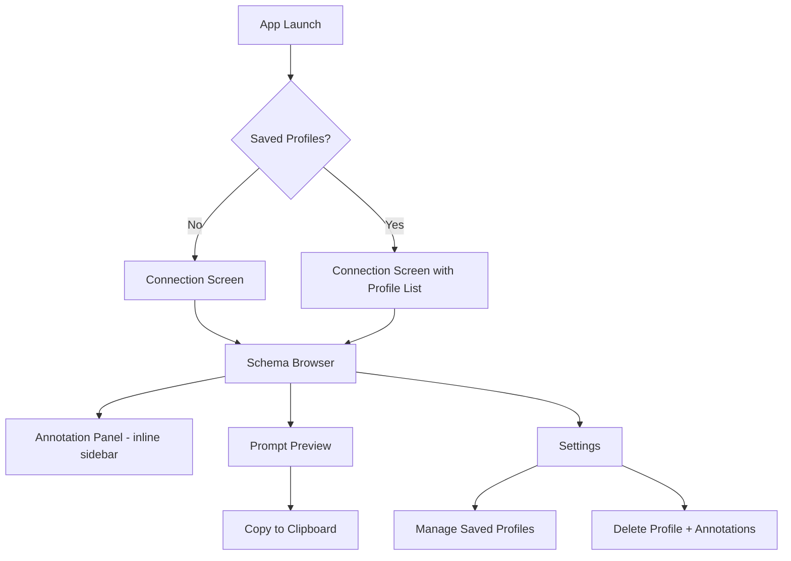
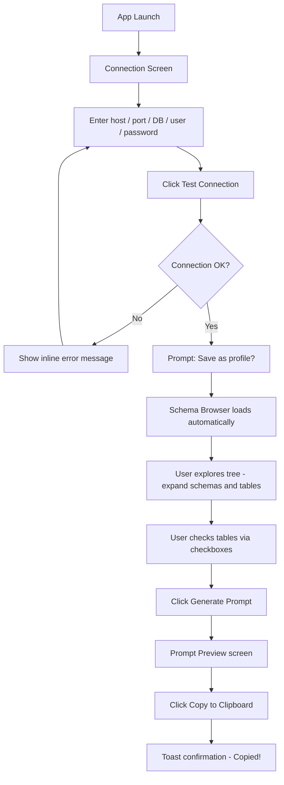
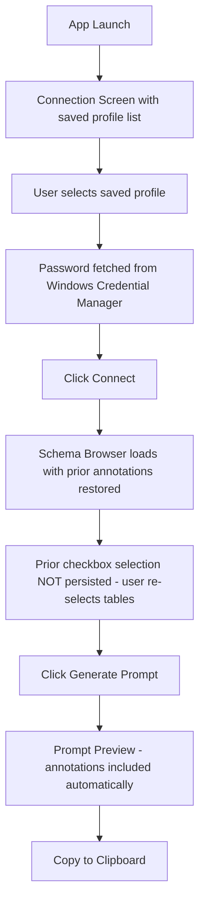
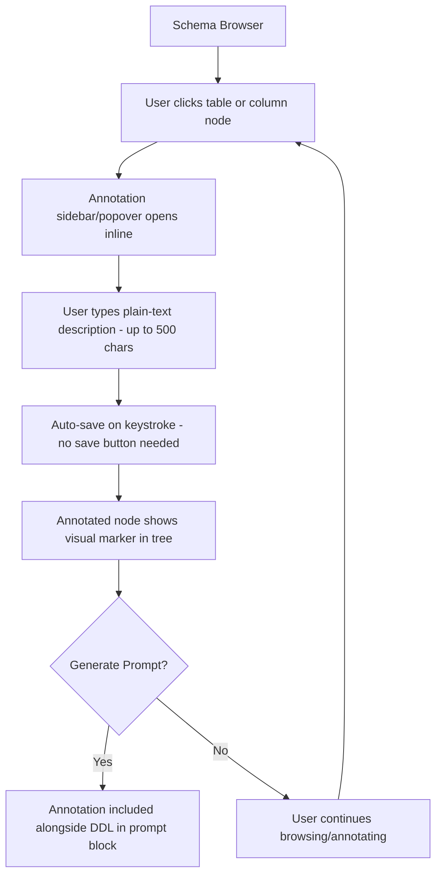

# SchemaLift UI/UX Specification

## Change Log

| Date | Version | Description | Author |
|------|---------|-------------|--------|
| 2026-05-15 | 1.0 | Initial draft | Sally (UX Expert) |

---

## 1. Introduction

This document defines the user experience goals, information architecture, user flows, and visual design specifications for **SchemaLift**'s user interface. It serves as the foundation for visual design and frontend development, ensuring a cohesive and user-centered experience.

### 1.1 Overall UX Goals & Principles

#### Target User Personas

**Power User — The Pragmatic Developer**
Mid-to-senior backend/fullstack developer who works with SQL daily (schemas of 20–200+ tables), already uses ChatGPT or Claude in their workflow, and currently wastes 15–30 min per session manually extracting DDL. They want speed, keyboard efficiency, and no hand-holding.

**Occasional User — The Data Analyst / BI User**
Works in SQL but isn't a software engineer. Struggles with complex joins on unfamiliar schemas and relies on developers for schema context. Needs a more guided experience and plain-language cues — but still must be able to use the core flow without SQL expertise.

#### Usability Goals

- **Speed to value:** A new user can complete the full connect → select → copy flow in under 2 minutes
- **Minimal cognitive overhead:** The UI should never require the user to think about WHERE the next step is — the path forward is always obvious
- **Error clarity:** Connection failures, empty selections, and permission issues show specific, actionable messages (not generic errors)
- **Memorability:** An infrequent user (e.g., analyst, 1-2x/week) can return and reorient in under 30 seconds
- **Efficiency for power users:** Frequent tasks (reconnect, re-select known tables, re-copy prompt) take ≤3 clicks for returning users

#### Design Principles

1. **Clarity over cleverness** — Every label, button, and layout choice should be obvious on first glance; no clever UI patterns that require learning
2. **Workflow as the UI** — The app's 5-screen structure mirrors the user's mental model (connect → browse → select → annotate → copy); the nav reinforces this sequence
3. **Progressive disclosure** — Column-level detail, annotation editors, and advanced options appear only when the user reaches that step — not before
4. **Persistent context, zero repetition** — Annotations and saved profiles eliminate re-work; the UI should make this compounding value visible (e.g., annotation counts, "last used" timestamps)
5. **Dark by default, density-friendly** — Developer-native aesthetic; dense information layout with clear hierarchy rather than whitespace-heavy consumer UI

---

## 2. Information Architecture (IA)

### 2.1 Site Map / Screen Inventory

### 2.2 Navigation Structure

**Primary Navigation:** Persistent left sidebar with 4 items — Connection, Schema Browser, Prompt Preview, Settings. Items are always visible but Schema Browser and Prompt Preview are disabled/greyed until a connection is active. Active item is highlighted. No icons-only mode — labels always shown.

**Secondary Navigation:** None at MVP. The schema tree within Schema Browser acts as the secondary navigation layer (schema → table → column hierarchy, expand/collapse).

**Breadcrumb Strategy:** Not applicable at MVP. The 5-screen linear flow is shallow enough that breadcrumbs add no value. The sidebar active state serves as location indicator.

---

## 3. User Flows

### 3.1 Flow 1: First-Time Connect → Select → Copy (Core Value Flow)

**User Goal:** Go from cold app launch to a copyable LLM prompt block in under 2 minutes.

**Entry Points:** App launch (no saved profiles)

**Success Criteria:** Prompt block copied to clipboard; user can immediately paste into ChatGPT/Claude

**Edge Cases & Error Handling:**
- Host unreachable → "Could not reach host — check your host/port and network connection"
- Auth failure → "Authentication failed — check your username and password"
- Empty selection on Generate Prompt click → inline warning "Select at least one table to generate a prompt"
- Very large schema (200+ tables) → loading spinner with "Extracting schema…" and 5s timeout guard
- User skips "Save profile" prompt → flow continues normally; they can save from Settings later

---

### 3.2 Flow 2: Returning User — Reconnect & Regenerate

**User Goal:** Reopen the app and regenerate their last prompt in under 30 seconds.

**Entry Points:** App launch (saved profiles exist)

**Success Criteria:** Prompt regenerated with persisted annotations and copied to clipboard

**Edge Cases & Error Handling:**
- Saved profile can no longer connect (DB moved/down) → show error on connect attempt; offer to edit profile credentials
- Credential not found in Windows Credential Manager → prompt user to re-enter password, offer to re-save
- Annotations exist but table was dropped from DB → show annotation with a warning indicator "Table no longer found in schema"

---

### 3.3 Flow 3: Table & Column Annotation

**User Goal:** Add business context to tables/columns so the LLM prompt is more accurate.

**Entry Points:** Schema Browser — clicking any table or column node

**Success Criteria:** Annotation saved automatically and included in the next generated prompt

**Edge Cases & Error Handling:**
- 500-char limit reached → character counter turns red, input stops accepting characters, no truncation without warning
- User clears annotation → visual marker removed from tree node; annotation deleted from SQLite
- Annotation on a column that is later deselected → annotation is persisted but NOT included in the prompt (only selected items appear)

---

## 4. Wireframes & Mockups

**Primary Design Files:** To be created in Figma post-spec. This section defines layout intent and key element placement to guide visual design. Reference: `[Figma link — TBD]`

### 4.1 Connection Screen

**Purpose:** First screen on cold launch. Allows users to enter PostgreSQL credentials or select a saved profile.

**Key Elements:**
- App logo/wordmark top-left (minimal — text only for MVP)
- Centered card layout (~480px wide, vertically centered)
- Form fields stacked: Host, Port (default 5432), Database, Username, Password (masked + show/hide toggle)
- Saved profiles dropdown above the form (visible only if profiles exist; hidden on cold start)
- "Test Connection" secondary button + "Connect" primary button side by side at bottom of card
- Inline status area below buttons: idle / loading spinner / success (green) / error (red + message)

**Interaction Notes:** Test Connection does not navigate away — result appears inline. Connect navigates to Schema Browser on success. Error messages are specific (auth vs. network vs. timeout), never generic.

**Design File Reference:** `[Figma — Connection Screen frame — TBD]`

---

### 4.2 Schema Browser (with Annotation Panel)

**Purpose:** Core working screen. Users spend most of their session here — exploring the schema tree, selecting tables, and adding annotations.

**Key Elements:**
- Persistent left sidebar nav (always visible, ~200px)
- Main content area: schema tree (left ~40%) + annotation panel (right ~60%, slides in on selection)
- Search/filter input pinned above the tree
- Tree nodes: schema → table → column, each with checkbox + expand arrow + annotation icon (if annotated)
- Selection counter badge: "3 tables / 12 columns selected" — pinned above the tree
- "Generate Prompt" prominent CTA button — pinned to bottom of screen, full-width, always visible
- Annotation panel: appears inline when a table/column is clicked; shows node name, type, char-count input, auto-save indicator

**Interaction Notes:** Checking a table auto-checks all columns (indeterminate state shown when partial). Annotation panel does not push the tree — it overlays or uses a split panel. Generate Prompt is always visible so the user never has to hunt for the next step.

**Design File Reference:** `[Figma — Schema Browser frame — TBD]`

---

### 4.3 Prompt Preview

**Purpose:** Read-only view of the assembled LLM prompt. User confirms the output before copying.

**Key Elements:**
- Read-only code block (full screen minus sidebar nav) — monospace font, dark background, subtle line numbers
- "Copy to Clipboard" button — top-right, prominent, sticky
- Toast notification on copy: "Copied!" — appears for 2 seconds, bottom-right
- "Back to Schema Browser" text link — top-left, low emphasis
- Prompt stats footer: character count, estimated token count (rough), table count included

**Interaction Notes:** No editing in this view — pure preview. The back link allows users to adjust their selection and regenerate without losing context.

**Design File Reference:** `[Figma — Prompt Preview frame — TBD]`

---

### 4.4 Settings / Profile Manager

**Purpose:** Manage saved connection profiles. Secondary screen — accessed occasionally, not part of the core daily flow.

**Key Elements:**
- List of saved profiles: name, host, last connected timestamp
- Inline rename (click to edit name in place)
- Delete button per profile — triggers confirmation modal before deletion
- Confirmation modal: "Delete 'My Prod DB'? This will also delete all annotations for this connection. This cannot be undone." with Cancel / Delete (destructive red) buttons
- Empty state: "No saved profiles yet. Connect to a database to save your first profile."

**Interaction Notes:** No "Add profile" button here — profiles are created from the Connection Screen. Deletion is a two-step action (click → confirm) to prevent accidental data loss.

**Design File Reference:** `[Figma — Settings frame — TBD]`

---

## 5. Component Library / Design System

**Design System Approach:** Use **shadcn/ui** (built on Radix UI primitives + Tailwind CSS) as the foundation. Dark theme only for MVP. Custom components are built only where shadcn/ui has no suitable primitive (e.g., the schema tree).

### Core Components

#### Connection Form Card
**Purpose:** Captures and validates PostgreSQL credentials on the Connection Screen.

**Variants:** Default (cold start) | With saved profiles dropdown (returning user)

**States:** Idle | Testing | Test Success | Test Error | Connecting

**Usage Guidelines:** Always show Port with default value pre-filled (5432). Password field always masked by default. Error messages appear inline below the button row — never as a modal or toast.

---

#### Schema Tree
**Purpose:** Renders the hierarchical database schema (schema → table → column) with checkboxes, expand/collapse, and annotation indicators.

**Variants:** Full tree | Filtered tree (search active)

**States:** Loading (skeleton rows) | Populated | Empty | Partial selection (indeterminate) | Fully selected | Annotated node

**Usage Guidelines:** Virtual rendering required for 200+ table schemas. Checkbox click on a table sets all children to checked. Annotation indicator is a subtle colored dot, not text.

---

#### Annotation Panel
**Purpose:** Inline sidebar that appears when a tree node is clicked. Allows plain-text context per table/column.

**Variants:** Table annotation | Column annotation

**States:** Empty | Typing | Saved | At limit (500 chars)

**Usage Guidelines:** Auto-saves on keystroke with 300ms debounce. No explicit save button. Character counter always visible ("142 / 500").

---

#### Prompt Code Block
**Purpose:** Read-only display of the generated LLM prompt on the Prompt Preview screen.

**Variants:** Populated | Empty (not reachable in normal flow)

**States:** Default | Copied (brief visual feedback)

**Usage Guidelines:** Monospace font (JetBrains Mono). No syntax highlighting. Line numbers visible. Horizontally scrollable. Copy button sticky at top-right.

---

#### Selection Counter Badge
**Purpose:** Shows current selection count (tables + columns) above the schema tree.

**Variants:** Zero selected | Active selection

**States:** Zero ("No tables selected") | Active ("3 tables · 12 columns selected")

**Usage Guidelines:** Always rendered — never hidden. Zero state: muted grey. Active state: accent color.

---

#### Generate Prompt CTA
**Purpose:** Primary action button triggering prompt generation. Pinned to the bottom of Schema Browser.

**Variants:** Standard

**States:** Disabled (no tables selected) | Active | Loading

**Usage Guidelines:** Full-width, pinned bottom bar. Disabled state shows tooltip: "Select at least one table to generate a prompt." Loading state: spinner inside button.

---

## 6. Branding & Style Guide

**Brand Guidelines:** No formal brand guidelines for MVP. Visual identity is derived from the product positioning: precise, trustworthy developer tool. Clean and neutral — never playful or consumer-facing.

### 6.1 Color Palette

| Color Type | Hex Code | Usage |
|---|---|---|
| Primary | `#4F8EF7` | Primary actions, active nav item, focus rings |
| Secondary | `#2D2D3A` | Card backgrounds, annotation panel, sidebar background |
| Accent | `#7C5CBF` | Annotation indicators, selection highlights |
| Success | `#3ECF8E` | Successful connection, "Copied!" toast, auto-save confirmation |
| Warning | `#F59E0B` | "Table no longer found" indicators, near-limit warnings |
| Error | `#EF4444` | Connection errors, auth failures, character limit, destructive actions |
| Neutral — Base | `#0F0F17` | App background (deepest layer) |
| Neutral — Surface | `#1A1A27` | Main content area background |
| Neutral — Elevated | `#2D2D3A` | Cards, panels, dropdowns |
| Neutral — Border | `#3D3D52` | Dividers, input borders, tree lines |
| Neutral — Muted | `#6B6B85` | Placeholder text, disabled states, secondary labels |
| Neutral — Default Text | `#E2E2EF` | Primary body text |
| Neutral — Subtle Text | `#A0A0B8` | Secondary labels, metadata, timestamps |

### 6.2 Typography

**Font Families:**
- **Primary (UI):** Inter
- **Secondary:** Not required for MVP
- **Monospace:** JetBrains Mono (Prompt Preview code block, schema tree type labels)

**Type Scale:**

| Element | Size | Weight | Line Height |
|---|---|---|---|
| H1 | 24px | 600 | 1.3 |
| H2 | 18px | 600 | 1.35 |
| H3 | 14px | 600 | 1.4 |
| Body | 13px | 400 | 1.5 |
| Small | 11px | 400 | 1.4 |

### 6.3 Iconography

**Icon Library:** Lucide React — lightweight, consistent stroke-based, MIT licensed, first-class React support.

**Usage Guidelines:**
- Icons always paired with text labels in navigation (no icon-only in MVP)
- Tree node type indicators: table icon for tables, list icon for columns
- Annotation indicator: small filled dot in accent color (`#7C5CBF`) — not an icon
- Action icons on buttons: 16px, placed left of label

### 6.4 Spacing & Layout

**Grid System:** Flexbox-based. Schema Browser uses two-column flex (tree + annotation panel). Sidebar nav fixed at 200px. Main content area fluid.

**Spacing Scale:**
- `4px` — tight: icon-to-label gap, tree node indent increment
- `8px` — small: input padding, badge padding, icon margins
- `12px` — base: form field gap, list item padding
- `16px` — medium: card padding, section gap within a panel
- `24px` — large: between major UI sections, card margin
- `32px` — xl: screen-level padding, empty state spacing

---

## 7. Accessibility Requirements

**Compliance Target:** No formal WCAG standard targeted for MVP. A pragmatic baseline is enforced — low-cost, high-impact practices that ship naturally with shadcn/ui and Radix UI primitives.

### 7.1 Key Requirements

**Visual:**
- Color contrast ratios: All primary text (`#E2E2EF`) on base background (`#0F0F17`) meets WCAG AA (~13:1 contrast ratio). Error state always includes text — never color alone as the sole signal.
- Focus indicators: Radix UI provides visible focus rings out of the box. Do not suppress `outline` in CSS. Style focus rings using primary blue (`#4F8EF7`).
- Text sizing: Minimum 11px (Small scale). No text below 11px in the UI.

**Interaction:**
- Keyboard navigation: All interactive elements reachable and operable via keyboard (Tab, Space, Enter, arrow keys for tree). Radix UI primitive guarantee — do not override `tabIndex` without reason.
- Screen reader support: Deferred to post-MVP. Aria labels on any icon-only buttons and all form inputs as baseline.
- Touch targets: Not applicable — Windows desktop, mouse/keyboard only.

**Content:**
- Alternative text: No decorative images in MVP. Icon buttons must have `aria-label`.
- Heading structure: Logical H1 → H2 → H3 hierarchy per screen. Do not skip heading levels.
- Form labels: All Connection Screen inputs have explicit `<label>` elements — no placeholder-only labeling.

### 7.2 Testing Strategy

Manual baseline validation before each epic ships:
1. Tab through all screens — verify all interactive elements reachable by keyboard only
2. Verify no focus rings suppressed in CSS (`outline: none` prohibited without custom replacement)
3. Run Chrome DevTools Accessibility panel on Connection Screen and Schema Browser to catch missing labels

Post-MVP: Commission WCAG 2.1 AA audit before targeting the Data Analyst persona at scale.

---

## 8. Responsiveness Strategy

> SchemaLift is a Windows desktop app. This section addresses window resizing behavior across common developer screen configurations.

### 8.1 Breakpoints

| Breakpoint | Min Width | Max Width | Target Devices |
|---|---|---|---|
| Compact | 900px | 1279px | Laptops, small monitors, side-by-side windows |
| Standard | 1280px | 1919px | 1080p and 1440p monitors — primary target |
| Wide | 1920px | — | 4K monitors, ultrawide displays |

> Minimum window size enforced by Tauri: **900×600px** (per PRD Story 1.2 AC4).

### 8.2 Adaptation Patterns

**Layout Changes:**
- **Compact (900–1279px):** Annotation panel stacks below the tree (not side-by-side). Nav sidebar remains 200px.
- **Standard (1280–1919px):** Canonical layout — tree (~40%) + annotation panel (~60%) side by side.
- **Wide (1920px+):** Content area max-width ~1400px centered in window. Margins absorb excess space.

**Navigation Changes:**
- Sidebar nav fixed at 200px at all breakpoints. No collapse/icon-only mode for MVP.

**Content Priority:**
- At compact widths, annotation panel closes by default when browsing the tree — opens on explicit node click only.
- Generate Prompt CTA bar is full-width and pinned at all breakpoints — never hidden or moved.
- Prompt Preview code block is horizontally scrollable at all breakpoints — DDL lines are never wrapped.

**Interaction Changes:**
- No touch interaction adaptations — mouse and keyboard only.
- Connection Screen card stays at max ~480px wide at all breakpoints.

---

## 9. Animation & Micro-interactions

### 9.1 Motion Principles

1. **Functional over decorative** — Every animation must serve a purpose. No animations for visual flair alone.
2. **Fast and unobtrusive** — Durations between 100–300ms. Developer users have low tolerance for UI that feels slow.
3. **Respect system preferences** — Honor `prefers-reduced-motion`. All animations degrade to instant state changes.
4. **Consistency over creativity** — Use `ease-out` easing universally. One motion language throughout.

### 9.2 Key Animations

| Animation | Duration | Easing | Notes |
|---|---|---|---|
| Tree node expand/collapse | 150ms | ease-out | Height animation 0 → full child height |
| Annotation panel slide-in | 200ms | ease-out | Slides in from right edge of tree area |
| Checkbox state change | 100ms | ease-in-out | Instant trigger, subtle fill animation |
| Generate Prompt loading state | — | — | Instant label swap to spinner; 600ms rotation |
| "Copied!" toast | 150ms in / 2000ms hold / 150ms out | ease-out | Bottom-right; does not block interactive elements |
| Auto-save "Saved" label | 100ms in / 1000ms hold / 300ms out | ease-out | Fades next to character counter |
| Connection message fade-in | 150ms | ease-out | Fades in place below button row |
| Nav item active crossfade | 100ms | ease-out | Background color crossfade on click |

---

## 10. Performance Considerations

### 10.1 Performance Goals

- **App cold start:** Under 4 seconds to Connection Screen rendered
- **Schema extraction:** Under 5 seconds for a 200-table PostgreSQL database on local network
- **Interaction response:** All UI interactions respond within 100ms
- **Prompt generation:** Under 1 second for any selection size (local string assembly — no network call)
- **Animation FPS:** 60fps for all transitions; no jank on tree expand/collapse at 200+ nodes

### 10.2 Design Strategies

- **Virtual rendering for the schema tree:** Use `@tanstack/virtual` — do not render all 1,000+ nodes to the DOM on large schemas
- **Debounce search input:** 150ms debounce on tree filter — not on every keypress
- **Lazy annotation loading:** Load annotations from SQLite on-demand as user expands nodes, not all at connect time
- **Prompt generation is synchronous and local:** Pure string concatenation — if it exceeds 500ms, investigate SQLite read bottleneck
- **Skeleton loading states:** Schema Browser shows skeleton rows during extraction — never a blank screen
- **No layout shift:** All panel dimensions fixed or use `min-height` to prevent content jumping

---

## 11. Next Steps

### 11.1 Immediate Actions

1. Share this spec with the architect for frontend architecture alignment — particularly the Schema Tree virtual rendering requirement and shadcn/ui + Tailwind stack confirmation
2. Create Figma frames for the 4 core screens (Connection, Schema Browser, Prompt Preview, Settings) using this spec as the design contract
3. Validate the compact-width (900px) annotation panel stacking behavior with a quick prototype before committing to the split-panel layout in code
4. Confirm JetBrains Mono licensing for desktop app distribution (SIL Open Font License — likely safe, but worth team sign-off)
5. Add a token count estimation utility to the backlog — the Prompt Preview token counter requires a client-side tokenizer (e.g., `tiktoken-lite`) and should be scoped as a story

### 11.2 Design Handoff Checklist

- [x] All user flows documented
- [x] Component inventory complete
- [x] Accessibility requirements defined
- [x] Responsive strategy clear
- [x] Brand guidelines incorporated
- [x] Performance goals established
